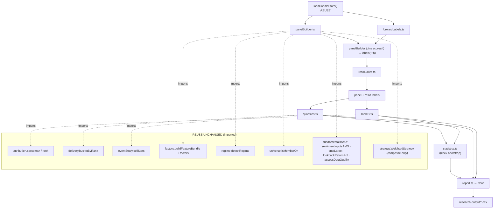

# Task 2 — Research Layer Design

Design of `src/research/`. Functional TypeScript (exported const arrow functions, pure, injected inputs, no classes, no wall-clock, no unseeded randomness). **Zero dependency** on `Trade`, `Position`, exits, portfolio caps, costs, execution.

Decisions locked with the operator:
- **Panel builder** mirrors the engine pre-pass by **importing every leaf helper** — the production replay path (`backtestEngine.ts`) stays byte-identical.
- **Size proxy** = `log(ADV)`, `ADV = close × volume` (rolling median). Documented approximation of market-cap weight (no shares-outstanding data exists).

---

## 1. Module diagram



---

## 2. Dependency graph — every import from existing code

| New module | Imports FROM existing code | Reimplements (new) |
|---|---|---|
| `forwardLabels.ts` | `CandleStore` (type) from `@/backtest` | forward-return alignment **generalised** from `runDeliveryStudy.forwardExcess` (raw + excess, 6 horizons) |
| `panelBuilder.ts` | `buildFeatureBundle`, `factors`, `emaLatest`, `lookbackReturnPct` (`@/factors`); `fundamentalsAsOf` (`@/fundamentals`); `sentimentInputsAsOf` (`@/news`); `assessDataQuality` (`@/ohlcv`); `detectRegime` (`@/regime`); `isMemberOn` (`@/universe/membership`); `canonicalSymbol` (`@/universe/symbols`); `WeightedStrategy` (`@/strategy`, composite readout only); `CandleStore` | the **ungated per-date orchestration** (all members, no gate/cooldown/DQ-filter; DQ recorded as a column) |
| `rankIC.ts` | `spearman` (`@/backtest/attribution`) | per-date IC averaging, ICIR, **Newey-West** t-stat |
| `quantiles.ts` | `bucketByRank` (`@/delivery/metrics`); `cellStats` (`@/events/eventStudy`) | EW/VW aggregation over deciles, spread |
| `residualize.ts` | — (pure linear algebra) | OLS of label on `[β, sector dummies, log-ADV]`; return residuals |
| `statistics.ts` | — (uses a seeded PRNG) | stationary block bootstrap 95% CI |
| `report.ts` | — | CSV emission to `research-output/` |
| `runResearch.ts` (script) | `loadCandleStore`, `prisma` | wiring only |

**Reused vs reimplemented, stated plainly:** ranking, decile bucketing, cell stats, forward-return alignment, candle/benchmark/universe/PIT/regime machinery, and the production composite are **imported**. Newly written: per-date IC + Newey-West + ICIR, VW aggregation, residualisation, block bootstrap, the ungated panel orchestration, and CSV plumbing. Nothing in the forbidden-duplication list (Task 3) is rewritten.

---

## 3. Public function signatures

```ts
// ── forwardLabels.ts ──────────────────────────────────────────────
// DAY CONVENTION: TRADING days. Entry = next bar after t (dates[i+1]),
// exit = dates[i+1+h]. null when insufficient forward data — never imputed.
// Generalises runDeliveryStudy.forwardExcess (excess-only) to raw + excess.
export type Horizon = 1 | 3 | 5 | 10 | 21 | 63;
export const HORIZONS: readonly Horizon[];

export type ForwardLabel = {
  date: string; symbol: string;
  fwd: Partial<Record<Horizon, number>>;   // raw close-to-close %, next-bar entry
  xs:  Partial<Record<Horizon, number>>;   // stock − benchmark over same window (PRI caveat)
};

export const buildForwardLabels: (store: CandleStore) => ForwardLabel[];
// helper (also exported for tests):
export const forwardReturn: (
  dates: string[], closes: Map<string, number>,
  benchByDate: Map<string, number> | null,
  date: string, h: number,
) => { fwd: number | null; xs: number | null };

// ── panelBuilder.ts ───────────────────────────────────────────────
// Ungated: every universe member (isMemberOn) on every trading date ≥ warmup.
// Reuses the engine's leaf helpers; NO gate / cooldown / DQ filter.
export type PanelRow = {
  date: string; symbol: string; instrumentId: string; sector: string | null;
  regime: 'BULL' | 'BEAR' | 'SIDEWAYS' | 'HIGH_VOL' | 'CRASH';
  scores: Record<string, number>;   // 8 factors + 'composite'
  dq: number;                        // DataQuality score (a SPLIT, not a filter — audit H-3)
  logAdv: number | null;            // size proxy: log(rolling-median close×volume)
  fwd?: Partial<Record<Horizon, number>>;  // joined from forwardLabels
  xs?:  Partial<Record<Horizon, number>>;
  resid?: Partial<Record<Horizon, number>>; // filled by residualize
};
export const buildFactorPanel: (
  store: CandleStore, opts?: { warmupIndex?: number; fromIndex?: number; toIndex?: number },
) => PanelRow[];
// join labels at t+h to scores at t:
export const joinLabels: (panel: PanelRow[], labels: ForwardLabel[]) => PanelRow[];

// ── rankIC.ts ─────────────────────────────────────────────────────
// Reuses attribution.spearman (tie-averaged). Per-date IC → mean, ICIR, NW t.
export type RankICResult = {
  meanIC: number; stdIC: number; icIR: number;
  tStat: number; neweyWestTStat: number; nDates: number;
};
export const rankIC: (
  panel: PanelRow[], subject: string,
  labelOf: (r: PanelRow) => number | null,   // fwd/xs/resid at a horizon
  opts?: { neweyWestLags?: number },
) => RankICResult;

// ── quantiles.ts ──────────────────────────────────────────────────
// Reuses delivery.bucketByRank + eventStudy.cellStats. EW and VW.
export type DecileCell = {
  decile: number; nObs: number; meanRet: number; medianRet: number;
};
export const quantileSpread: (
  panel: PanelRow[], subject: string,
  labelOf: (r: PanelRow) => number | null,
  weighting: 'EW' | 'VW',            // VW uses exp(logAdv) as weight
  nDeciles?: number,
) => DecileCell[];

// ── residualize.ts ────────────────────────────────────────────────
// Per DATE, OLS of label on [1, beta, sectorDummies, logAdv]; residual = label − fit.
// beta = trailing OLS of stock return on benchmark return (window injected).
export const residualizeLabels: (
  panel: PanelRow[], store: CandleStore,
  horizon: Horizon, labelType: 'fwd' | 'xs',
  opts?: { betaWindow?: number },
) => PanelRow[];   // returns panel with resid[horizon] populated

// ── statistics.ts ─────────────────────────────────────────────────
// Stationary block bootstrap (Politis–Romano). Seeded PRNG — deterministic.
export const blockBootstrapCI: (
  series: number[], stat: (xs: number[]) => number,
  opts?: { block?: number; reps?: number; seed?: number; alpha?: number },
) => { point: number; ciLow: number; ciHigh: number };

// ── report.ts ─────────────────────────────────────────────────────
export const writeCsv: (path: string, header: string[], rows: (string | number)[][]) => void;
```

---

## 4. Composite readout (no baseline change)

The `composite` subject reuses the **production** `WeightedStrategy.evaluate(bundle, regime)` purely to read `compositeScore` — the same regime-weighted blend the live system uses. No config or scoring logic is touched; the panel builder only *reads* the number. Per-factor scores come straight off `bundle.results[name].score`.

## 5. Statistics scope (Task 8 — implement these and nothing more)

per-date rank IC · ICIR · Newey-West t · stationary block bootstrap 95% CI · EW & VW decile spreads · residualised returns. No Fama-MacBeth, no PBO/DSR, no permutation tests unless they change inference.

## 6. Day-convention declarations (Task 7)

Every module docstring states: **labels and horizons are TRADING days**; entry is the **next bar** after the score date; this differs from the simulator's calendar-day `timeStopDays` (a 7-cal-day exit ≈ `fwd5`). `residualize`/`quantiles` also state the **`log(ADV)` size-proxy** approximation and the **PRI benchmark** caveat on `xs`/`resid`.

---

## 7. Build/commit order (Task 5)

```
forwardLabels → panelBuilder → rankIC → GATE A (harness) → GATE B (12-1 momentum)
             → quantiles → residualize → statistics → report → measurement (Task 8)
```
Each stage: pure functions + `*.test.ts` alongside; `bun run typecheck` and `bun test` green before the next. Gate A failure ⇒ stop (bug). Gate B soft-failure ⇒ add reversal control, escalate only if both fail while A passes.
